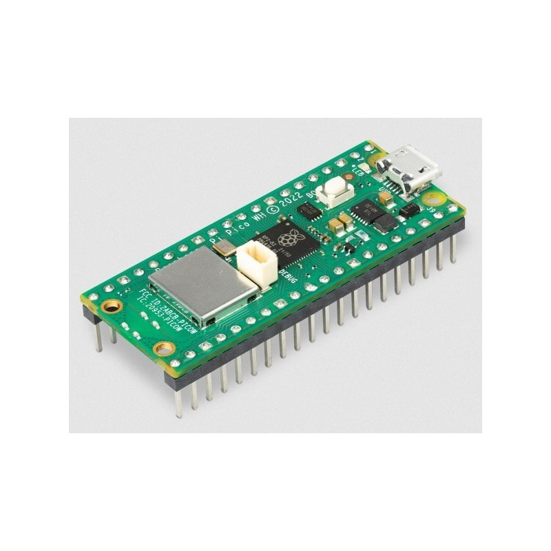
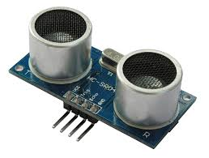
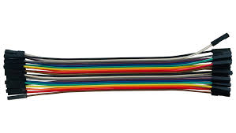
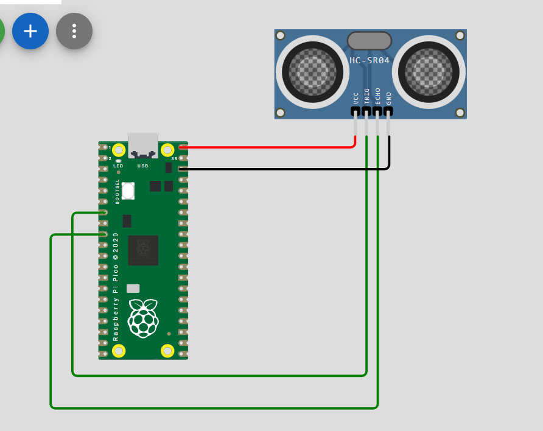

# HCSR04(Ultrasonic sensor)
## Objective
To interface an HC-SR04 ultrasonic distance sensor with the Raspberry Pi Pico W using CircuitPython.

## Hardware theory
## The 4 pins
1.Vcc:Power
2.GND:ground(0 v)
3.TRIG:(Trigger)The microcontroller sends a tiny 10-microsecond HIGH pulse to this pin. This tells the sensor to blast a burst of 8 ultrasonic sound waves (at 40 kHz, above human hearing) into the air.
4.ECHO: After the sound fires, this pin goes HIGH. It stays HIGH while the sound travels through the air, bounces off an object, and returns. Once the sensor hears the echo, this pin drops back to LOW.

## Logic
By measuring exactly how long the ECHO pin stayed HIGH, we know the total round-trip flight time of the sound wave.

Since the speed of sound in air is relatively constant(343 m/s)
we calculate the distance using this formula:D=time*343/2.

## Software setup
Because timing microsecond pulses in standard Python can be tricky due to how the interpreter handles memory, Adafruit provides a pre-written, highly optimized library to do the heavy lifting.
```
1.Download the Adafruit CircuitPython Library Bundle for your specific version of CircuitPython.
2.Unzip it and locate the adafruit_hcsr04.mpy file.
3.Drag and drop that file directly into the lib folder on your CIRCUITPY drive.
```

## Architecture
We used the following components:

Raspberry pi pico W


Ultrasonic sensor HCSR04


Cables


## Schematics


## Source code
```python
# SPDX-FileCopyrightText: 2021 ladyada for Adafruit Industries
# SPDX-License-Identifier: MIT

import time

import board

import adafruit_hcsr04

sonar = adafruit_hcsr04.HCSR04(trigger_pin=board.GP5, echo_pin=board.GP6)

while True:
    try:
        print((sonar.distance,))
    except RuntimeError:
        print("Retrying!")
    time.sleep(0.1)
```
## Output
```
>>> %Run -c $EDITOR_CONTENT
(5.304,)
(5.304,)
(84.473,)
(5.304,)
(5.304,)
(5.304,)
(5.304,)
(84.473,)
(5.304,)
(5.304,)
(5.304,)
(5.304,)
(5.304,)
(5.304,)
(5.304,)
(5.304,)
(5.287,)
(5.304,)
(5.287,)
(5.304,)
(5.304,)
(5.304,)
(84.473,)
(5.304,)
(84.49,)
(5.304,)
(5.304,)
(5.304,)
(5.304,)
(5.304,)
(84.473,)
(5.304,)
(5.304,)
(84.473,)
(84.49,)
(5.304,)
(5.304,)
(5.304,)
(5.304,)
(5.304,)
(5.304,)
(5.304,)
```