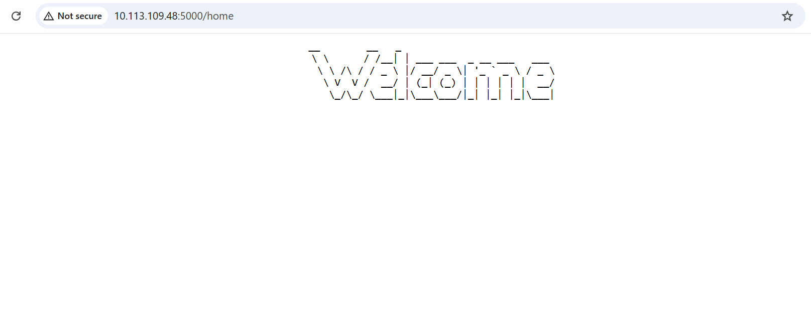

# To serve our raspberry pi pico w a html page 
## Firmware implementation
```python
import socketpool
import wifi

from adafruit_httpserver import Request, Response, Server

WIFI_SSID = "Godfrey"
WIFI_PASSWORD = "12345678"

print(f"Connecting to {WIFI_SSID}...")
wifi.radio.connect(WIFI_SSID, WIFI_PASSWORD)
print(f"Connected to {WIFI_SSID}")

pool = socketpool.SocketPool(wifi.radio)

server = Server(pool, "/static", debug=True)


@server.route("/home")
def base(request: Request):
    return Response(request, """
    <html>
        <head>
            <title>Pico Server</title>
        </head>
        <body>
            <pre style="text-align:center; font-size: 14px;">
   __        __   _                            
   \ \      / /__| | ___ ___  _ __ ___   ___  
    \ \ /\ / / _ \ |/ __/ _ \| '_ ` _ \ / _ \ 
     \ V  V /  __/ | (_| (_) | | | | | |  __/ 
      \_/\_/ \___|_|\___\___/|_| |_| |_|\___| 
</pre>
        </body>
    </html>
    """, content_type="text/html")
server.serve_forever(str(wifi.radio.ipv4_address))

```
## Outcome
