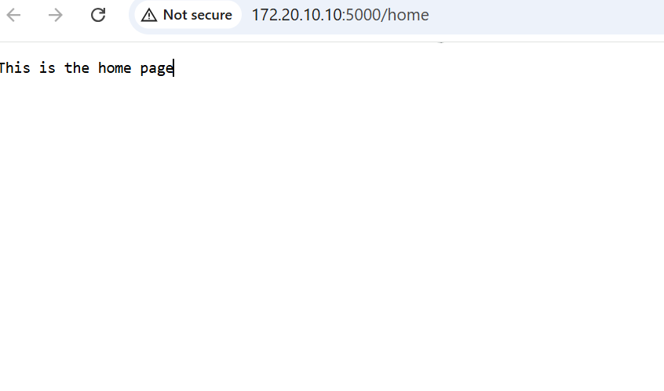

# Objective
```
Using Raspberry pi pico w to build a server
```
## Firmware implemantation
```python
import socketpool
import wifi

from adafruit_httpserver import Request, Response, Server

WIFI_SSID = "iPhone"
WIFI_PASSWORD = "Hubris123"

print(f"Connecting to {WIFI_SSID}...")
wifi.radio.connect(WIFI_SSID, WIFI_PASSWORD)
print(f"Connected to {WIFI_SSID}")

pool = socketpool.SocketPool(wifi.radio)

server = Server(pool, "/static", debug=True)


@server.route("/home")
def base(request: Request):
    """
    Serve a default static plain text message.
    """
    return Response(request, "This is the home page")


server.serve_forever(str(wifi.radio.ipv4_address))
```
## Outcome
The pico w connects to wifi (in this case it was my personal hotspot),it gets an IP address and listens for responses from a browser amd sends back responses.
