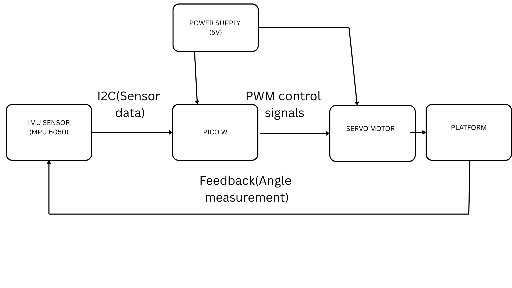
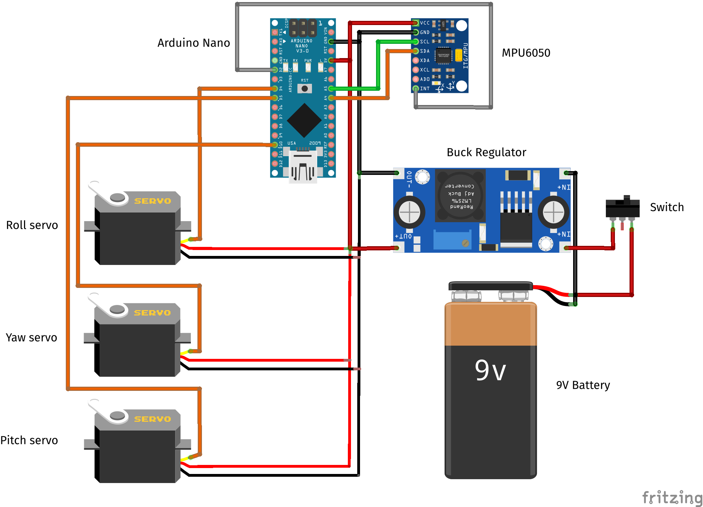

# Design and Implementation of a Low-Cost Smart Self-Leveling Platform Using Embedded Control Systems

## Background
Stability and orientation control are fundamental requirements in many modern engineering applications such as drones, camera systems, robotics, and aerospace systems. In dynamic environments, mechanical platforms are often subjected to vibrations, tilting, and external disturbances that affect their performance and accuracy.

To address this challenge, stabilization systems based on embedded sensors and feedback control mechanisms are widely used. These systems continuously monitor orientation and apply corrective actions using actuators to maintain a desired position.

This project proposes the design and implementation of a smart self-leveling platform that uses real-time sensor feedback and control algorithms to maintain a stable horizontal orientation under external disturbances.
## Problem definition
Many portable and mobile systems suffer from instability due to motion, vibration, or uneven surfaces. This instability leads to:

- Poor quality in camera footage
- Inaccurate sensor readings in mobile systems
- Reduced performance in robotic applications
- Inefficiency in precision equipment

A particularly pressing real-world example is the experience of wheelchair users navigating everyday terrain.Ramps, curb cuts, cobblestones and sloped pathways cause standard mounted trays to tilt unpredictably, risking spills of liquids, meals or medical supplies. This poses both a safety concern and a barrier to independence especially for users with limited upper-body mobility.

Commercial stabilization systems exist; however, they are often expensive and complex, making them less accessible for educational and low-cost applications.


## Objective
### General
To design and implement a low-cost embedded system that maintains a stable platform orientation using real-time feedback control,with a focus on assistive technology appliications for wheelchair users. 

### Specific
- To design a tilt detection system using an Inertial Measurement Unit (IMU)
- To develop a real-time feedback control algorithm for stabilization
- To implement actuator-based correction using servo motors
- To achieve stable platform leveling within 2 degrees under external disturbances
- To demonstrate a practical assistive use case by simulating wheelchair tray stabilization on uneven surfaces.
- To keep total hardware cost under $40 ensuring the solution remains accessible and replicable. 
## System architecture
### Components
#### Sensor unit
An IMU sensor MPU6050 IMU ( accelerator and gyroscope) is used to measure angular displacement (roll and pitch) of the platform in real time.
#### Control unit
A microcontroller processes sensor data and executes a control algorithm to determine corrective actions ( a raspberry pi pico w)
#### Actuation unit
Servo motors are used to physically adjust the platform angle and counteract disturbances, restoring it to a level position.(SG90)
#### Power supply
The system uses a shared  battery power source stepped down to a stable 5V using a buck regulator .This ensures clean ,consistent power delivery to both the Raspberry Pi Pico W and the SG90 servo motors, preventing voltage fluctuations that could affect control accuracy and IMU sensor readings.
#### Platform
A 3D-printed platform frame,lightweight low-cost mounting structure.

### Block diagram


### Hardware implementation
Reference image

```
The system is built using an IMU sensor (MPU6050), a microcontroller such as the Raspberry Pi Pico W, and two servo motors. The IMU measures the platform’s orientation in real time, while the microcontroller processes this data and sends control signals to the servos. The servos then adjust the platform angle to maintain stability.
```
### Control strategy
The system uses a closed-loop feedback control process to maintain a level platform. The logic works as follows:

- The IMU sensor continuously measures the current tilt angle of the platform (roll and pitch).

- The microcontroller compares the measured angle with the desired reference angle (0° level position).

- The difference between these values is calculated as the error signal.

- The controller processes this error and computes a correction value.

- The correction value is converted into a PWM signal that drives the servo motors.

- The servos adjust the platform position to reduce the error.


This process repeats continuously in real time, forming a feedback loop.

### Application
This system has several real-world applicatiuons where maintaining a stable horizontal surface is critical:

- **Camera stabilization** - Preventing blur and drift in mobile photography and videography.

- **Drone payload control** - Keeping sensors or cargo levle during flight.

- **Robotics** - Maintaining orientation in mobile robot platforms.

- **Automotive sensor alignment** - Ensures accurate readings in moving vehicles.

#### Featured Use Case: Wheelchair Assistive Tray
A key motivating application for this project is an affordable self-leveling tray for wheelchair users. Wheelchair users frequently navigate uneven surfaces ;ramps and sloped pathways causing standard mounted trays to tilt unpredictably.This risks spilling liquids or dropping essential items, limiting independence particularly for users with limited upper-body mobility.
This platform addresses that problem directly. Mounted to a standard wheelchair frame, it uses the MPU6050 IMU to detect tilt caused by the terrain and drives the SG90 servo motors to keep the tray surface level in real time ,with a total component cost under **$40** , it offers a genuinely commercial assistive device.


